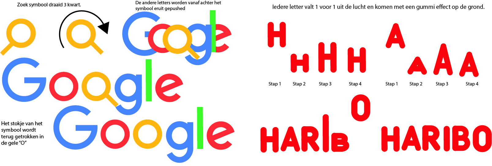
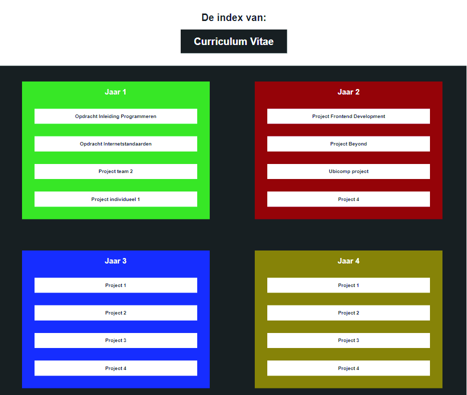
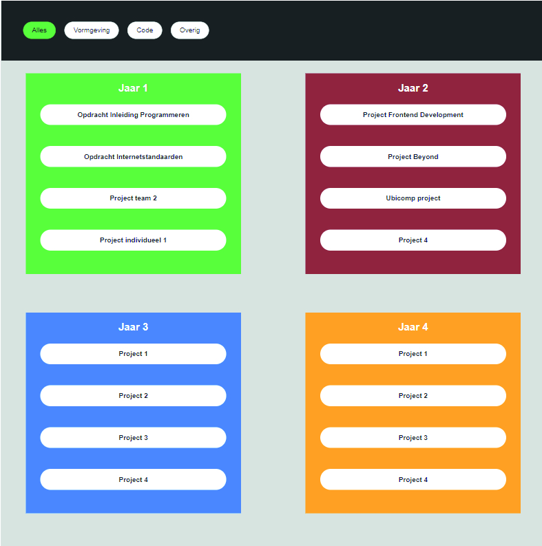

# Procesverslag
**Auteur:** Mila Steneker

**Het werk:** [opdracht 1](opdracht1/index.html) en [opdracht 2](opdracht2/index.html)

Markdown cheat cheet: [Hulp bij het schrijven van Markdown](https://github.com/adam-p/markdown-here/wiki/Markdown-Cheatsheet). Nb. de standaardstructuur en de spartaanse opmaak zijn helemaal prima. Het gaat om de inhoud van je procesverslag. Besteedt de tijd voor pracht en praal aan je website.

## Bronnenlijst
1. https://developer.mozilla.org/en-US/docs/Web/CSS/animation-timing-function
2. www.w3schools.com
3. https://css-tricks.com/adding-stroke-to-web-text/

## Je 'posts' (je code-dagboek)

Je procesverslag is een soort dagboek.
Bij elk voortgangsgesprek en het eindgesprek voeg je een ‘post’ aan je dagboek toe.

In zo’n ‘post’ neem je op:
- Wat je van plan was
- Je werk zo ver
- Wat er goed ging
- Wat er lastig is
- Wat je plannen zijn

## Voortgang 1.1
Voor de eerste voortgang had ik nog niet echt een planning. Ik was nog een beetje zoekende in hoe ik alles ging maken. Ik heb voor nu alleen nog de fonts en kleuren gezocht en de google letters in mijn code gezet.

## Voortgang 1.2
Ik wou op dit moment 1 animatie werkend hebben en daar feedback op kunnen krijgen. Het ging mij gemakkelijker af dan ik dacht. Met een beetje zoeken op internet en terugkijken van de oefenopdrachten kwam ik er vaak snel uit. Hierdoor was ik ook al begonnen met mijn 2e animatie. Bij deze liep ik tegen een paar dingen aan, die heb ik aan de kant gezet tot het voortgang gesprek.

## Voortgang 1.3
Ik heb de dingen die ik meegenomen heb van het tweede voortgangs gesprek aangepast en toegevoegd. Verder ben ik nog gaan werken om de darkmode toe te voegen aan mijn animaties. Dit was makkelijk om te doen, omdat het vrij voor zich spreekt. Ik heb de laatste details toegevoegd aan de animaties.

## Bronnenlijst
1. Oefening Recap: - Toetsen 2
2. Oefening Libraries: - Drag and Drop
					   - Filteren

## Voortgang 2.1
Ik heb voor de eerste voortgang niks gedaan i.v.m. drukte. Wel (omdat ik al een basis website had) heb ik al een opzet van de html.

## Voortgang 2.2
Voor het extra gesprek heb ik het verschuiven van de projecten werkend gemaakt en de eerste sorteer dingen ingevoegd. Ik heb alles in een grid gezet op de pagina responsive te maken.

Op dit moment wou ik in ieder geval 2 basis interacties af hebben. Na een extra gesprekje had ik de preview functie werkend gekregen. Hierna heb ik gezorgt dat je een pijltje kreeg te zien als een <a> in focus is. Hiervoor heb ik naar de code gekeken uit de vorige opdracht en deze zo veranderd dat het hierbij werkt. Hierna ben ik verder gegaan met het invoegen van kleur variabelen. Dit had ik nog niet gedaan en besefte dat als ik dat nu niet zou doen het aan het einde heel veel werk werd. Ik heb hier en daar de vormgeving wat aangepast en extra hovers en dergelijke toegevoegd. 

Voor de eindoplevering wil ik zorgen dat wanneer de preview is uitgeklapt het pijltje naar binnen draait. Dat er een mooie header staat met eventueel een leuke animatie met mijn naam. En dat de darkmode goed werkend is. Het ontwerp kan nu nog iets mooier, samenhangender. En mijn code moet nog opgeruimd worden en netjes neergezet.

## Voortgang 2.3

